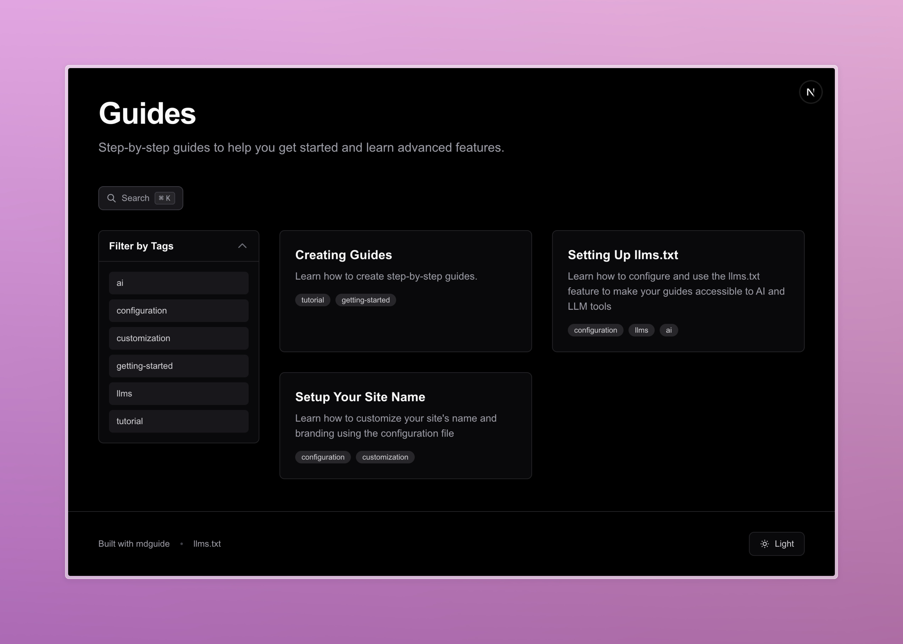

# mdguide

A modern, interactive documentation and guide platform built with Next.js. mdguide helps you create beautiful, searchable, step-by-step guides with progress tracking and an intuitive user experience.

**Perfect for creating documentation sites, tutorials, courses, and step-by-step guides.**



## ✨ Features

- 📚 **Step-by-Step Guides** - Break down complex topics into manageable, trackable steps
- 🔍 **Full-Text Search** - Fast, client-side search powered by FlexSearch
- 📊 **Progress Tracking** - Automatically track user progress through guides with local storage
- ✍️ **MDX Support** - Write guides in Markdown with full MDX support
- 🎨 **Syntax Highlighting** - Beautiful code highlighting out of the box
- 🖼️ **Dynamic OG Images** - Automatic Open Graph images for social media sharing
- 📱 **Responsive Design** - Mobile-first design built with Tailwind CSS 4
- 🌙 **Dark Mode** - Full dark mode support
- 🤖 **LLM-Friendly** - Automatic llms.txt generation for AI/LLM consumption
- 🔒 **Type-Safe** - Built with TypeScript for better developer experience
- ⚡ **Fast & Modern** - Built on Next.js 16, React 19, and Tailwind CSS 4

## 🚀 Quick Start

### Using This Template

The fastest way to get started:

1. **Click "Use this template"** button on GitHub to create your own repository

2. **Clone your new repository:**
   ```bash
   git clone https://github.com/YOUR-USERNAME/YOUR-REPO-NAME.git
   cd YOUR-REPO-NAME
   ```

3. **Install dependencies:**
   ```bash
   npm install
   ```

4. **Run the setup wizard:**
   ```bash
   npm run setup
   ```

   This interactive wizard will:
   - Configure your site name and branding
   - Update package information
   - Optionally delete example guides
   - Optionally create a starter guide
   - Optionally reinitialize git with clean history

5. **Start the development server:**
   ```bash
   npm run dev
   ```

6. **Open [http://localhost:3000](http://localhost:3000)** to see your site!

### Manual Setup

Prefer to set up manually? See the [SETUP.md](SETUP.md) guide for detailed instructions.

## 📖 Documentation

- **[SETUP.md](SETUP.md)** - Complete setup and configuration guide
- **[CLAUDE.md](CLAUDE.md)** - Detailed architecture and development guide
- **Example Guides** - Check `app/guides/` for example content (marked with `isExample: true`)

## 🛠️ Tech Stack

- **Framework**: [Next.js 16](https://nextjs.org/) with App Router
- **UI**: [React 19](https://react.dev/)
- **Styling**: [Tailwind CSS 4](https://tailwindcss.com/)
- **Content**: MDX with [react-markdown](https://github.com/remarkjs/react-markdown)
- **Search**: [FlexSearch](https://github.com/nextapps-de/flexsearch)
- **Language**: [TypeScript 5](https://www.typescriptlang.org/)

## 📁 Project Structure

```
mdguide/
├── app/
│   ├── [slug]/           # Dynamic route for guides
│   ├── api/guides/       # Search API endpoint
│   ├── components/       # React components
│   ├── config/
│   │   └── site.ts       # 👈 Main configuration file
│   ├── guides/           # 👈 Your guide content (MDX files)
│   ├── hooks/            # React hooks
│   ├── lib/guides/       # Guide processing logic
│   └── types/            # TypeScript types
├── scripts/
│   └── setup.js          # Interactive setup wizard
├── SETUP.md              # Setup documentation
└── package.json
```

## 📝 Creating Guides

Create a new guide by adding a directory in `app/guides/` with a `page.mdx` file:

**Example: `app/guides/my-guide/page.mdx`**

```mdx
---
title: Getting Started
description: Learn the basics of mdguide
author: Your Name
date: 2025-10-31
tags: [beginner, tutorial]
published: true
---

Introduction to your guide...

## Step 1: First Step

Step content here. Each `##` heading creates a new step.

## Step 2: Second Step

More content with code examples:

```javascript
console.log("Hello, mdguide!");
```

## Step 3: Conclusion

Wrap up your guide!
```

After creating your guide, it will be available at `http://localhost:3000/my-guide`

See [SETUP.md](SETUP.md) for detailed guide creation instructions.

## 🤖 llms.txt Support

mdguide automatically generates an `llms.txt` file from your guides, making your documentation easily accessible to AI and LLM tools.

### Configuration

Enable or disable llms.txt in **[app/config/site.ts](app/config/site.ts)**:

```typescript
llmsTxt: {
  enabled: true,              // Toggle llms.txt generation
  includeStepContent: false,  // Include full content or just titles
}
```

### Features

- **Automatic Generation**: All published guides are included in `/llms.txt`
- **Configurable**: Choose to include full step content or just titles
- **Footer Link**: A link appears in the footer when enabled
- **LLM-Optimized**: Follows the [llms.txt specification](https://llmstxt.org/)
- **Static Generation**: Built at compile time for optimal performance

When enabled, your llms.txt file will be available at `http://localhost:3000/llms.txt` and includes:
- Guide titles and descriptions
- Author and date information
- Tags and metadata
- Step-by-step content (if enabled)
- Table of contents with anchor links

## 🖼️ Dynamic Open Graph Images

mdguide automatically generates beautiful Open Graph images for social media sharing.

### Features

- **Automatic Generation**: Homepage and every guide get custom OG images at build time
- **Social Media Optimized**: Perfect 1200x630px size for Twitter, Facebook, LinkedIn, etc.
- **Dynamic Content**: Shows guide title, site name, author, and step count
- **Beautiful Design**: Gradient background with professional typography
- **Custom Image Support**: Option to use your own custom image for the homepage
- **Zero Configuration**: Works out of the box with no setup required

### How It Works

When you share a URL, social media platforms automatically fetch the custom OG image:
- **Homepage** (`/`): Shows site title and description
- **Guide pages** (`/guide-name`): Shows guide title, author, and metadata

### Using a Custom Homepage Image

Want to use your own custom OG image for the homepage?

1. Place your image in the `public/` directory (e.g., `public/og-image.png`)
2. Update **[app/config/site.ts](app/config/site.ts)**:
   ```typescript
   openGraph: {
     homepageImage: '/og-image.png',
   }
   ```

Guide pages will continue using dynamically generated images.

### Customization

Want to customize the generated images?
- **Homepage**: Edit **[app/opengraph-image.tsx](app/opengraph-image.tsx)**
- **Guide pages**: Edit **[app/[slug]/opengraph-image.tsx](app/[slug]/opengraph-image.tsx)**

You can:
- Change colors and gradients
- Adjust typography and layout
- Add your logo or branding
- Modify the visual style

## 🛠️ Development

### Available Commands

```bash
npm run dev     # Start development server
npm run build   # Build for production
npm run start   # Start production server
npm run lint    # Run ESLint
npm run setup   # Run interactive setup wizard
```

### Key Files to Customize

- **[app/config/site.ts](app/config/site.ts)** - Site name, description, branding
- **[app/guides/](app/guides/)** - Your guide content (MDX files)
- **[app/components/](app/components/)** - UI components for customization
- **[package.json](package.json)** - Project metadata

## 🗺️ Roadmap

Planned features for future releases:

- [ ] Export guides to PDF
- [ ] Multi-language support
- [ ] Advanced search filters
- [ ] Analytics and insights
- [ ] Community themes and plugins

## 🤝 Contributing

Contributions are welcome! Whether it's bug fixes, new features, documentation improvements, or feedback:

1. Fork the repository
2. Create your feature branch (`git checkout -b feature/amazing-feature`)
3. Commit your changes (`git commit -m 'Add amazing feature'`)
4. Push to the branch (`git push origin feature/amazing-feature`)
5. Open a Pull Request

Please ensure your code follows the existing style and includes appropriate documentation.

## 📄 License

This project is open source and available under the [MIT License](LICENSE).

## 🙏 Acknowledgments

mdguide is built with amazing open-source tools:

- [Next.js](https://nextjs.org/) - The React Framework
- [Tailwind CSS](https://tailwindcss.com/) - Utility-first CSS framework
- [MDX](https://mdxjs.com/) - Markdown for the component era
- [FlexSearch](https://github.com/nextapps-de/flexsearch) - Full-text search library
- [gray-matter](https://github.com/jonschlinkert/gray-matter) - YAML frontmatter parser

---

**Built with ❤️ using mdguide**

[⭐ Star on GitHub](https://github.com/john-rock/mdguide) • [📖 Documentation](SETUP.md) • [🐛 Report Bug](https://github.com/john-rock/mdguide/issues) • [💡 Request Feature](https://github.com/john-rock/mdguide/issues)

